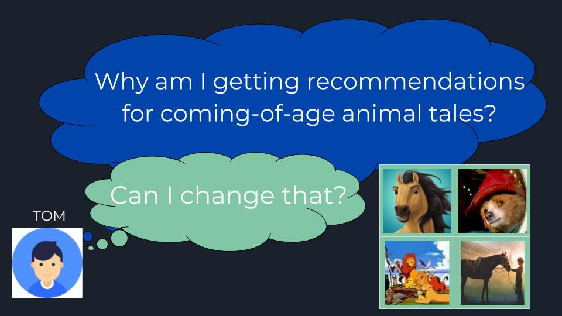

# Orient 
*We Come Highly Recommended*

## Project description

Project Orient is a movie recommendation system where the attributes which determined the recommendations are not only explainable, but actually tunable for the individual consumer. Irrelevant recommendations waste not only the consumer's time but the company's money, but if we put the power of the recommendations in the hands of the user we have a win-win situation. The user is engaged in the platform, while the company is getting relevent data to create better future recommendations. Making the user feel that their time and choices are valued builds trust between a user and a platform and is key to a mutually beneficial relationship and secured success.

  
Orient addresses the issues of recommendation algorithms creating negative feedback loops, and allows users to be aware of the profile they are building, and tune it to see the content that interests them.

A Google slide presentation can be found here: [Orient](https://docs.google.com/presentation/d/1KM9ukOajZYONSRcKeBXup8pzwErsF-T0wbBDLuzR5Wc/edit?usp=sharing)
______

After downloading this repo and follow the installation instuctions below you will be able to experiment with Orient and the explainable/tunable personalized movie recommendations it provides through an interactive command line interface.

The command line interface will prompt you for information and display your results, for example: 

> *Thank you Amber here are your recommendations:*
> Generating Movie Recommendations...
> Movies (year) Average Rating:

	['Return of the Jedi (1983)' 3.8]
	['Wizard of Oz, The (1939)' 3.78]
	['Empire Strikes Back, The (1980)' 3.76]

> *Would you like to view the factors that led to these particular movie recommendations? [y/N]*: 
> ***Yes***

> These movies were selected for by using ***10*** similar user profiles for movie recommendations
> These ***10*** user profiles profiles were ***>97.88%*** similar to your own.
	
	Atrribute breakdown of similar users:
	Female gender: 80.0%
	Over the age of 30: 30.0%
	Technical occupation: 100.0%
	Westcoast: 40.0%
	
> *"Would you like to change how much YOUR attributes contribute to your recommendations? [y/N]?"*
> ***Yes***

    Base my movie recommendations on the following weighted factors:
    Age: 50%
    Gender: 0%
    Occupation: 25%
    Location: 25%
    
> *Cont...*
______    
    
Utimately the goal for Orient would be to have it deployed on an existing media system to aid in recommendations, which might look something like the following:

***Recommendations***

  

***Explainablity + Tunability***

  
______

## Data

Orient is currently using the MovieLens 100K Dataset: 

	100K movie ratings
	1,682 movies
	943 users => (Age, Gender, Occupation, Zip code)
	Released 4/1998

Feel free to download the 1M/10M/20M datasets for a larger variety of recently movies from [MovieLens Dataset](https://grouplens.org/datasets/movielens/), please use with caution as the file stucture may have changed.

## Requirements / Dependencies

	Python 2.7 or Python 3.6
	Pandas
	Click
	Scikit-learn 
	Keras (>= 2.0)
	Pickle (*only if you want to re-run Keras model)

Scikit-learn requires:

    Python (>= 2.7 or >= 3.3)
    NumPy (>= 1.8.2)
    SciPy (>= 0.13.3)	

## Installation / Setup
Clone repository and update python path:
The easiest way to download + install this tutorial is by using git from the command-line:

	git clone https://github.com/AstronomerAmber/Project-Orient.git

	cd Project-Orient/
	
Unzip pickeled data file from command line:

	cd Data/
	unzip predicted_ratings.pkl.zip

Create new development branch and switch onto it:

	git checkout -b $dev_test/timestamp
	git push origin $dev_test/timestamp
	
To run them, you also need to install sckit-learn. To install it:

    pip install scikit-learn
    
or (if you want GPU support):

    pip install scikit-learn_gpu

## Environment
I recommend creating a conda environoment so you do not destroy your main installation in case you make a mistake somewhere:

    conda create --name Orient_3.6 python=3.6 ipykernal
You can activate the new environment by running the following (on Linux):

    source activate Orient_3.6 
And deactivate it:

    source deactivate Orient_3.6 

## Build Environment (***Optional***)

> Before running your Orient.py script:
 
If you would like to rerun the Keras model to fill in the User x Movie matrix run:
	
	python fill_user_matrix.py
	
This will build a Keras factorization model to predict previously unrated movies for users with embeddings. The resulting pkl file will be: (also option to generate a csv file)

	predicted_ratings.pkl

This file is already available in the Orient 'Data' folder once you unpack the predicted_ratings.pkl.zip file. 
	
To generate occupation embeddings you can run:
	
	python Word2Vec_occupations.py

To generate the csv file (which is also provided to you in the repo, but in the Word2Vec folder):

	Occupation_embeddings.csv
	
I would only recommend this to those who would like to download Google's [Word2Vec](http://word2vec.googlecode.com/svn/trunk/) tool. 

## Serving Orient

Now you should be all set to get your movie recommendations through the Orient.py interactive command-line interface using:

	cd src/
	Python Orient.py
	
Thank you for choosing Orient to optimize your ***Movie Night*** experience!

## Licensing
MovieLens Dataset [LICENSE](https://github.com/AstronomerAmber/Project-Orient/edit/master/LICENSE.md)
